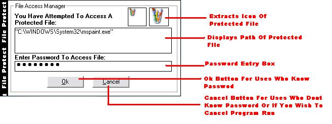



## Stop Any Program Before Its Even Run

### Description

disables any program before it is even run that means the program is not run and then just hidden but not opened at all until the correct password is entered can be set to block access to any file and password can be changed .does this by modifying exe run in registry easy to understand and modify please commant and rate
 
### More Info
 

             |
---                |---
**Submitted On**   |2004-08-23 19:57:02
**By**             |[Gareth CodeMan](https://github.com/Planet-Source-Code/PSCIndex/blob/master/ByAuthor/gareth-codeman.md)
**Level**          |Intermediate
**User Rating**    |4.7 (14 globes from 3 users)
**Compatibility**  |VB 5\.0, VB 6\.0
**Category**       |[Miscellaneous](https://github.com/Planet-Source-Code/PSCIndex/blob/master/ByCategory/miscellaneous__1-1.md)
**World**          |[Visual Basic](https://github.com/Planet-Source-Code/PSCIndex/blob/master/ByWorld/visual-basic.md)
**Archive File**   |[Stop\_Any\_P1785098232004\.zip](https://github.com/Planet-Source-Code/gareth-codeman-stop-any-program-before-its-even-run__1-55775/archive/master.zip)

